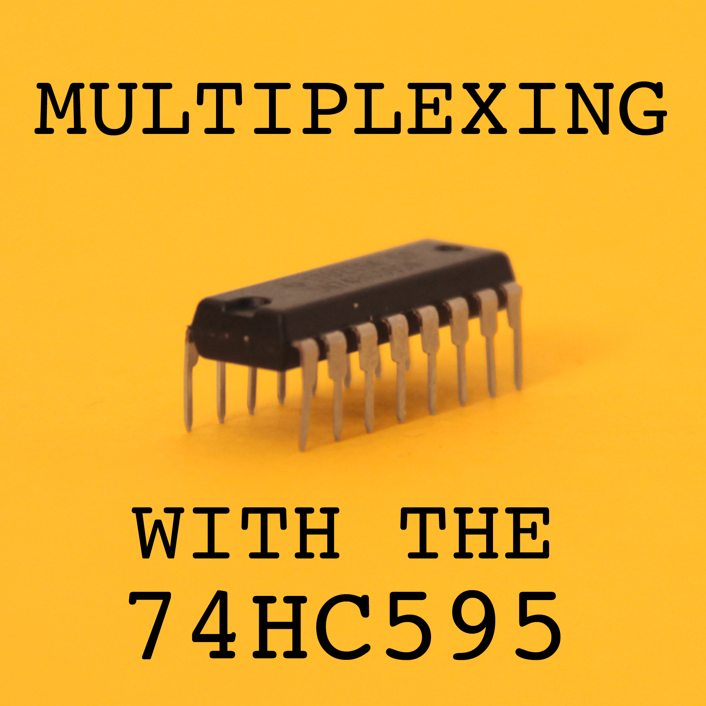
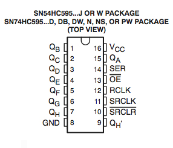
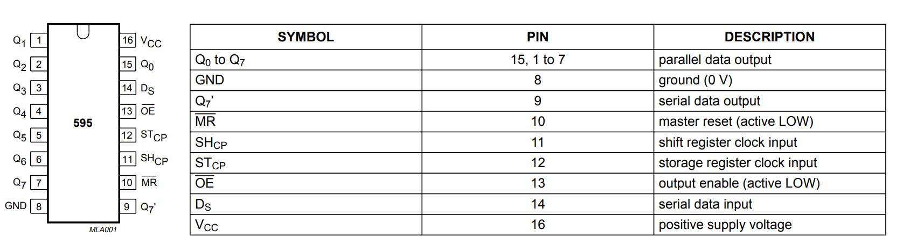

# Register_SN74HC595
This repository is to explain how the SN74HC595 register works

## Aujourd’hui on va apprendre à comment augmenter le nombre de sortie d’un arduino avec un registre à décalage 74HC595.
Le nombre de sortie logique d’un arduino est limité et souvent on peut avoir besoin de beaucoup de sorties (relais, led, afficheurs …), nous allons voir comment avec 3 fils commander de 8 à X sorties logique.

### Le circuit intégré SN74HC595 (Schéma du circuit)

### Description du SN74HC595

**SHCP:**  À chaque fois qu'on envoie un signal ***HAUT*** sur SHCP on va décaller d'un cran le régistre c'est-à-dire colonne 1,2.... ainsi de suite.

**STCP:**  Lui il permet d'apppliquer ou non la valeur envoyée au régistre décallage (Tant que STCP est à l'état ***BAS*** on peut envoyer les infos au régistre et dès qu'on envoie à STCP un état ***HAUT*** il va appliquer les valeurs envoyées)

**DS:**  Lui il permet de définir la valeur que l'on veut envoyer à la colonne

**MR:**  Lui il permet de tout remettre à zéro (***RESET***) comme on l'utilise pas souvent on le met sur ***GND*** à 0.

**OE:**  Lui il permet d'activer ou non le régistre décallage c'est-à-dire si on veut faire réduire l'intensité des ***LED***, on branche une sortie ***PWM*** de l'arduino et on envoie une valeur inférieure à 255 (Valeur MAX)

**Q7':**  Lui il permet de mettre en série plusieurs régistres décallage (***On connecte Q7' au pin DS du prochain registre.***)

**Q0 à Q7:**  Représentent les colonnes.

### Schéma de montage

